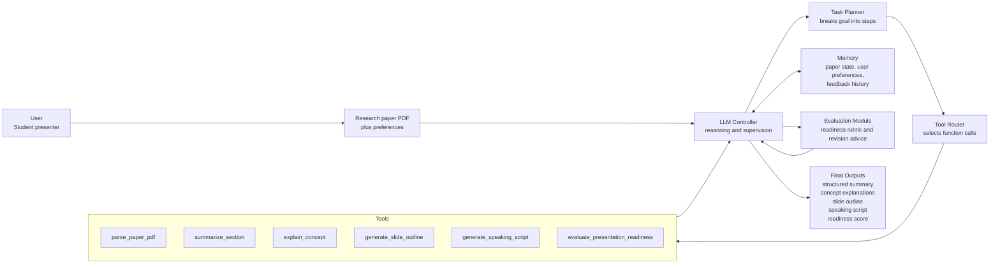
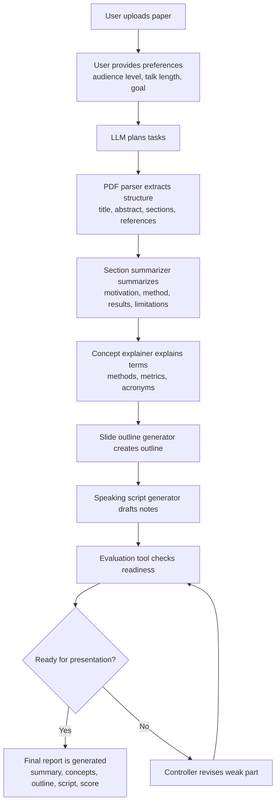
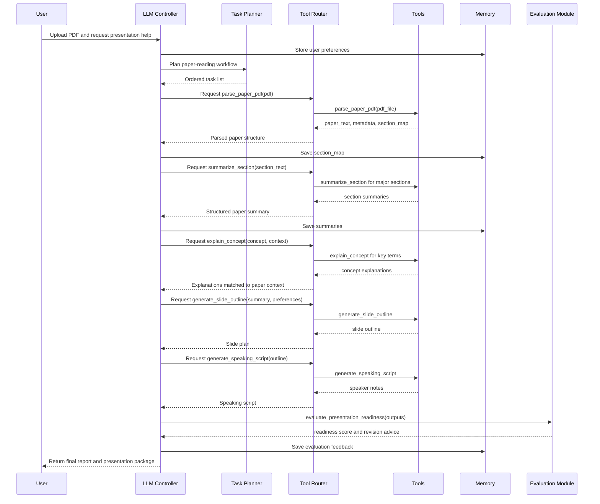

# HW4 Infographic: AI Paper Reading and Presentation Assistant

This infographic summarizes the proposed AI harness system for helping a student read a technical research paper and prepare a presentation. The system is a design/mock prototype: it defines the architecture, tools, memory, and orchestration logic, but it is not presented as a fully deployed product.

## 1. AI System Architecture

**Explanation:** The LLM controller is the central decision maker. It receives the user goal, asks the task planner to break the work into steps, uses the tool router to call specialized tools, stores intermediate artifacts in memory, and sends the final materials through an evaluation module before returning them to the student.

## 2. Agent Workflow

**Explanation:** The workflow moves from paper ingestion to presentation readiness. The system first builds a structured understanding of the paper, then generates presentation artifacts, then evaluates whether the result is strong enough. If the evaluation identifies a weak component, the controller loops back and revises it.

## 3. Function Calling / Tool Chain

**Explanation:** This sequence diagram shows when each function is called and what data is passed. The controller does not directly generate every artifact in one step. It calls tools through the router, stores results in memory, and uses the evaluation module to decide whether the presentation package is ready.

## Visual Summary

- **Controller role:** plan, call tools, inspect outputs, revise weak artifacts.
- **Tool role:** perform specialized operations with explicit inputs and outputs.
- **Memory role:** preserve paper context, user preferences, intermediate drafts, and feedback.
- **Evaluation role:** check accuracy, coverage, clarity, slide quality, and delivery readiness.
- **Final output:** a structured paper-reading and presentation package for the student.
