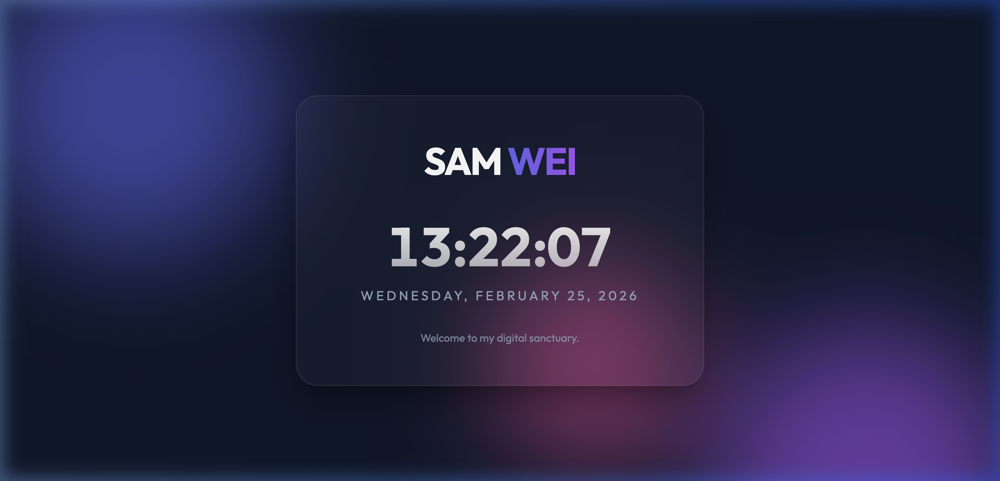

# L1-PersonalPage - Sam WEI

This is a premium, single-page personal website designed for Sam WEI. It features a modern "glassmorphism" aesthetic and interactive real-time elements.

## 🚀 Features
- **Dynamic Clock**: Displays the current local time (hours, minutes, seconds).
- **Interactive UI**: Subtle 3D tilt effect on the central card that follows mouse movements.
- **Modern Design**: Glassmorphism aesthetic with vibrant gradient background animations.
- **Fully Responsive**: Optimized for both mobile and desktop views.

## 🖼️ Preview

## 🛠️ Built With
- HTML5 (Semantic Structure)
- CSS3 (Vanilla CSS, Glassmorphism, Animations)
- JavaScript (Clock logic & Interactivity)

## 🔗 Live Demo
Check out the live page here: [Sam WEI Personal Page](https://cachouuu.github.io/DRL/L1-PersonalPage/index.html)
